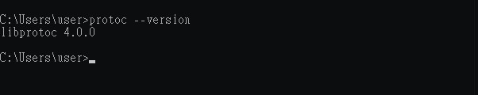
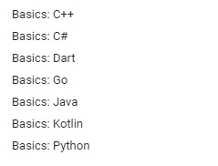
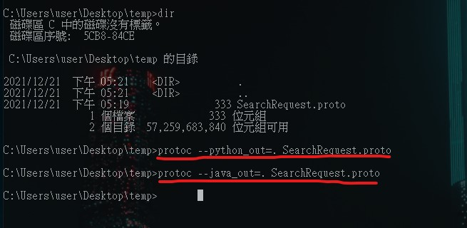
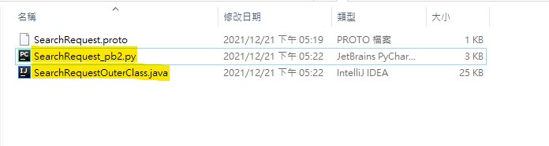

# protobuf 以及 varint32

<br>

---

<br>

protobuf 是 Google 推出了一種資料格式，可以理解成 JSON XML 的一種。他的優勢是更小、更快，而且更簡潔，能夠節省網路與硬體資源，且你只需要定義一次資料結構，接著就會自動生成符合你程式語言的檔案，讓你能夠直接在你的程式上使用。

<br>

protobuf 3 的官方文件：https://developers.google.com/protocol-buffers/docs/proto3

<br>
<br>

## 下載編譯器

<br>

當然，protobuf 編譯工具是需要 download 的，官方釋出版放在 github 上：https://github.com/protocolbuffers/protobuf/releases

找最新版 download 下來並設定環境變數。像是我在編寫這份文件時是 2021/12/21，此時最新版本是 3.19.1，開發平台是 windows。所以可以下載這個：

<br>


<br>

環境變數設定就不演示了，一切設定好後就可以測試看看版號：

<br>



<br>
<br>
<br>
<br>

## Protobuf 編寫&編譯

<br>

接下來簡單介紹一下 protobuf 編寫規範。__這邊只會挑出重點的說，如果要完全精通 protobuf 設計理念還是需要完整看過官方文件。__

<br>

以下是一段簡單的 `.proto` 文件：

```protobuf
syntax = "proto3";

/* SearchRequest represents a search query, with pagination options to
 * indicate which results to include in the response. */

message SearchRequest {
  string query = 1;
  int32 page_number = 2;  // Which page number do we want?
  int32 result_per_page = 3;  // Number of results to return per page.
}
```

<br>

* 第一行指定正在使用 `proto3` 語法。如果不寫明事 `proto3` 則默認使用 `proto2` 版。

* 隨後就事定義一個名為 `SearchRequest` 的 proto 消息，裡面有 `query` `page_number` `result_per_page` 三個 Field，型態分別是一個 string 與兩個 int32。

* Field 定義後面需要分配 Field Numbers，`query` 是 1 ，`page_number` 是 2，`result_per_page` 是 3。每一個 Field 都有一個唯一（unique）的編號。這用於再二進為位格式中標示出 Field。1 ~ 15 以內的數字占用 1 byte， 16 ~ 2047 需要占用到 2 個 bytes。

<br>

當我們像這樣定義好一個 `.proto` 文件之後就可以使用 protoc 工具來編譯成我們所需要的語言版本了。舉賴來說就是指定 java 的話就會編成 `.java` 文件，指定成 python 的話就會編成 `.py` 文件。

<br>

protobuf 支援以下幾種語言：

<br>



<br>

這邊示範一下編譯上面寫好的 SearchRequest，我們編譯 java 與 python 兩個版本：

<br>

```
$> protoc --python_out=. SearchRequest.proto

$> protoc --java_out=. SearchRequest.proto
```

<br>



<br>

編譯好後就可以在相同目錄中得到兩份文件：

* SearchRequest_pb2.py

* SearchRequestOuterClass.java

<br>



<br>
<br>
<br>
<br>

