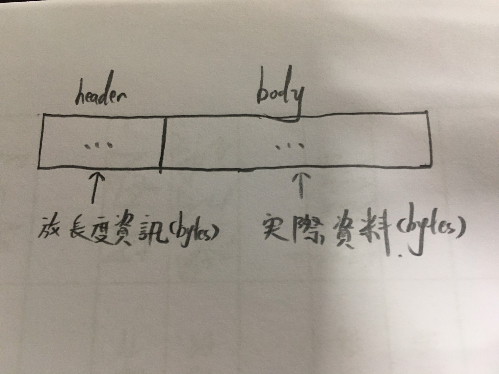
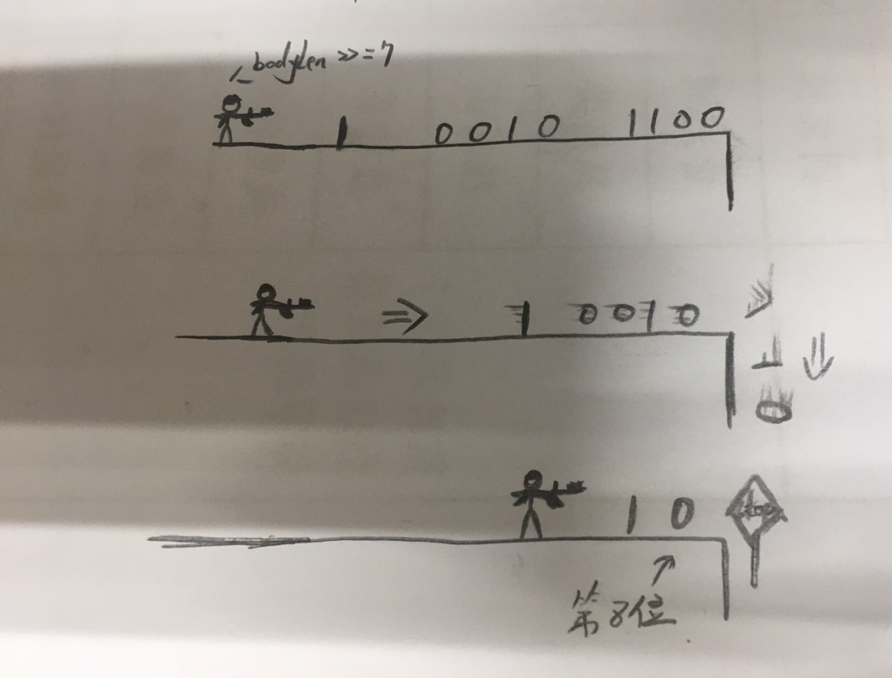

# 實現 varint32 encoder 與 decoder (python 實作)

<br>

---

<br>

varint32 的 encoder 與 decoder python 是找不到現有實作的套件的（至少在 2019 年之前我沒有找到過），因為使用 protobuf 所以實現一個 python 版本的 encoder 與 decoder 是必要的事情。參考過 java netty 的 varint32 的設計方法，於是就得出了這一篇實作筆記。

<br>
<br>
<br>
<br>

## 大綱

<br>

* [Varint32 Encoder](#1)

* [Varint32 Decoder](#2)

<br>
<br>
<br>
<br>

<div id="1">

## Varint32 Encoder

<br>

```py
def frameEncoder(record_bytes):
    bodyLen = len(record_bytes)  # 取出一筆 record 的長度
    stream = bitstring.BitStream()
    writeRawVarint32Header(stream, bodyLen)  # 把 record 的長度寫入 stream 內(fream header) 
    stream.append(record_bytes)  # 把 record 的 bytes 資訊寫入 stream 
    return stream.tobytes()
```

<br>

這邊需要先解釋一下一個封包的結構:

<br>



<br>

在一個訊框 ( frame ) 中需要有 header 與 body，header 需要存放 body 的長度資訊。

已知訊框結構，現在來看一下 `frameEncoder()` 方法細節：

<br>

```py
bodyLen = len(record_bytes)
stream = bitstring.BitStream()
writeRawVarint32Header(stream, bodyLen)
```

<br>

`stream` 是用來存放 bit 資料的物件，我們需要把整串訊息放入這個 `stream` 中。`writeRawVarint32Header(bitstring.BitStream: stream, int: bodyLen)` 方法是用來產生訊框標頭的。這個方法會單獨抽出來解釋，裡面有一些運算細節需要講解：

<br>

在解析 code 之前，先說明一下這邊需要做到什麼。__我們再這邊需要產生一個 varint32 的訊框標頭(存放 frame body 長度)，這意味著要做的就是把長度資訊轉成 varint32 編碼。__

<br>

varint32 原理在上一個章節已經提到過了，至於具體如何實現就像下面這樣：

<br>

```py
def writeRawVarint32Header(stream, bodyLen):
    while True:
        if bodyLen & 0x7F == 0:  # 0x7F = 127
            stream.append(int.to_bytes(bodyLen, length=1, byteorder='big'))
            break
        else:
            stream.append(int.to_bytes((bodyLen & 0x7F) | 0x80, length=1, byteorder='big'))  # 0x80 = 128
            bodyLen >>= 7
```

<br>

我們直接帶入一個例子來講解，假如傳入的 `bodyLen` 參數是 `300`，我們要把這個 300 轉成 varint32。這在上一個章節已經實際演算過了，這邊就是把演算過程變成 python code 而已。

<br>

第一個 `if` 判斷式 `if bodyLen & 0x7F == 0`，0x7F 是 127 的 16 進制寫法。我們這邊把 0x7F 轉換成 2 進制，也把 `bodyLen` ( 300 ) 轉成 2 進制然後進行 `AND` 運算看看：

<br>

```
300  = 0001 0010 1100
0x7F = 0000 0111 1111

# AND 運算
1 0010 1100
0 0111 1111 (AND)
--------------------------
0 0010 1100
```

<br>

其實仔細想一下應該會發現跟 0x7F 做 AND 運算其實就是在保留 1~7 位有效字元，7 位以上的位元都變 0 了。

繼續往下看由於 `300 & 0x7F` 不滿足判斷式，所以進入 `else` 邏輯。else 在做的事情如下：

```py
stream.append(int.to_bytes((bodyLen & 0x7F) | 0x80, length=1, byteorder='big'))
```

<br>

重點在這裡： `(bodyLen & 0x7F) | 0x80`。前面已經講過了 `bodyLen & 0x7F` 是保留有效 7 位元，0x80 是十進制 128，與 128 做 `OR` 運算過程如下：

```
bodyLen & 0x7F = 0010 1100
0x80           = 1000 0000 

# OR 運算
0010 1100
1000 0000 (OR)
-------------------
1010 1100
```

<br>

這邊其實仔細看一下也會發現，與 `128 (1000 0000)` 做 OR 運算其實就是在第八個位元加上一個 1 而已，也就是前面章節介紹 varint32 時提到的加入一個表達後續仍有資料的位元。

經過一輪運算之後，我們正是得到表達 300 的第一個 varint32 byte 資料：`1010 1100`。

接下來還要做一件事，因為原本的 1~7 位已經被寫入 stream 了，所以要把 300 的 1~7 位刪除掉，於是要使用到位元移位運算符號。

```py
bodyLen >>= 7
```

<br>

簡單理解就是把 `300 (1 0010 1100)` 往右邊擠 7 位，擠掉的就不存在了，保留從 8 位開始的資料：



<br>

線在我們剩下 `10` 了，重新回到上面的 if 判斷式，過程就不再贅述了，總之還是會進入到 else 邏輯並得到最終結果：

```
10 --- varint32 ---> 1000 0010
```

<br>

然後 `10 >>= 7` 運算會把 `bodyLen` 值清零，重新回到 if 判斷式就會滿足 `bodyLen & 0x7F == 0` 條件了。把一個空 bytes 放入 `stream` 中。

<br>

所以經過完整的 function 運算過後，stream 裡面應該存放如下資料

<br>

```
stream = 1010 1100 1000 0010 0000 0000
         --------- --------- ---------
           byte1     byte2     byte3  
```

<br>

我們用 3 個 bytes 表達了 300 這個 `bodyLen`。回到 Encoder 的部分，在把 header 資訊加入倒 stream 之後要做的就是把 record 資訊進接著加入倒 header 之後：

<br>

```py
writeRawVarint32Header(stream, bodyLen)  # 把 record 的長度寫入 stream 內(fream header) 
stream.append(record_bytes)  # 把 record 資訊加進來
return stream.tobytes()
```

<br>

這樣一來一筆 record 就背包裝好了，__也許到這邊你會問為什麼 record 資訊沒有進行 varint32 轉碼操作呢，實際上，google protobuf 內建已經有把 Proto Data 轉成 varint32 編碼的方法了，這邊看到的 record 是已經轉碼過後的了，我們實作 `writeRawVarint32Header()` 方法的原因就是因為 google 官方沒有提供，不然也不會有這一篇筆記了。__

<br>
<br>
<br>
<br>

<div id="2">

## Varint32 Decoder

<br>

Decoder code 只有 3 行，邏輯比較清晰一點。在 Encoder 部分我們知道一串訊息封包由 header + body 組成，長度資訊在 header 裡，所以在接收資料方面，第一件事就是遵循 varint32 原則，解析出 body 有多長，並根據 body 長度從 `tcpCliSock` 取出該長度的 bytes 資料進行 protobuf 轉碼，變成可讀資料。 

<br>

```py
def frameDecoder(tcpCliSock):
    data_len = getBodyLength(tcpCliSock)  # 取得 body 長度資訊
    return tcpCliSock.recv(data_len, socket.MSG_WAITALL)
```

<br>

來看看 `getBodyLength()` 怎麼寫的吧：

<br>

```py
def getBodyLength(tcpCliSock):
    readable_length = 0
    head_array = []

    for i in range(1, 6):
        try:
            head_data = tcpCliSock.recv(1, socket.MSG_WAITALL)  # 收標頭
            head_array.append(head_data)
            if int.from_bytes(head_data, byteorder='big', signed=True) >= 0:
                readable_length = computeReadableRawSize(head_array)
                break
        except ConnectionResetError:
            print('Connection has been terminated by PbServer on your host.')
            sys.exit(0)

    return readable_length
```

<br>

因為在 Java Netty 的 varint32 Decoder 中發現似乎對 varint32 訊息的標頭最大長度定義是 5 個 bytes，所以這邊也設定一個訊息標頭最大為 5 bytes。

<br>

一樣在開始解析細節之前，先講一下這邊的 code 需要解決怎樣的需求。

* 首先最核心的需求就如同 func 名稱一樣，我們要取得 bodyLength 資訊。varint32 是以一個 byte 為一個單位的，所以就需要一個一個 byte 的抓出來判斷是否後面有接續的資訊 ( 透過第8個 bit 判斷 )。

* 當完整 varint32 header 收集完畢後 ( 結束位元 `0000 0000` 不算 )，算出 bodyLength 資訊。

<br>

帶著以上的整理，我們來看一下 coding 實作：

<br>

```py
for i in range(1, 6):
        try:
            head_data = tcpCliSock.recv(1, socket.MSG_WAITALL)  # 收標頭(一個 bytes)
            head_array.append(head_data)
            ......
```

<br>

先收一個 bytes 的 header 資訊並放入 `head_array` 中。接下來緊接著寫了一個 if 判斷式：

<br>

```py
if int.from_bytes(head_data, byteorder='big', signed=True) >= 0:
```

<br>

__這邊主要想做的事其實是透過 `int.from_bytes()` 方法，將 `signed` 參數調為 `True`。這個方法稍微解釋一下，如果 `signed` 調為 `True` 則會把第八位 bit 看做正負號（`+` `-`），如果第八位是 `1` 則代表這是一個負整數，如果是 `0` 則是正整數，這邊我就是利用這個方法判斷當前 byte 的第八位是 `0` 還是 `1`。判斷式中如果發現結果是一個正整數 （int >= 0），則代表這是一個結束 bytes （`0000 0000`）。__

<br>

當條件達成時，就可以計算收集到的有效 `head_array`，並離開迴圈。

<br>

```py
readable_length = computeReadableRawSize(head_array)
break  # 離開回圈
```

<br>

接下來看一下 `computeReadableRawSize()` 是如何設計的吧：

<br>

```py
def computeReadableRawSize(head_array):

    readable_length_array = []

    for index, data in enumerate(head_array):

        temp = int.from_bytes(data, byteorder='big', signed=False)

        if int.from_bytes(data, byteorder='big', signed=True) < 0:
            temp ^= 0x80  # 若 bin 開頭為 1 就換成 0

        temp <<= (index * 7)
        readable_length_array.append(temp)

    readable_length = 0

    for data in readable_length_array:
        readable_length += data

    return readable_length
```

<br>

